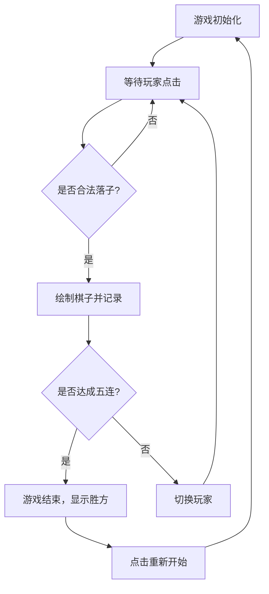

## 1. 产品概述
旨在开发一个高度还原真实体验的单文件 HTML 五子棋游戏。
- 该游戏无需任何环境配置或外部依赖安装，支持在现代浏览器中即开即玩。
- 提供精美的 UI 界面、流畅的下棋体验、完整的五子棋规则判定（包含胜负判定、黑白轮流落子）。
- 旨在为玩家提供轻量级、便携且具有良好视觉效果的休闲游戏体验。

## 2. 核心功能

### 2.1 角色
| 角色 | 注册方式 | 核心权限 |
|------|----------|----------|
| 本地玩家 | 无需注册 | 进行对局操作、重新开始游戏 |

### 2.2 功能模块
1. **游戏主界面**：包含棋盘区域、状态提示区域、操作按钮（重新开始、悔棋等）。
2. **规则引擎**：处理落子逻辑、胜负判定（五子连珠）、落子历史记录。

### 2.3 页面详情
| 页面名称 | 模块名称 | 功能描述 |
|----------|----------|----------|
| 主页面 | 游戏棋盘 | 绘制 15x15 标准棋盘，响应玩家点击事件进行落子，渲染黑白棋子。 |
| 主页面 | 状态面板 | 显示当前轮到的玩家（黑方/白方），以及游戏结束后的胜负结果。 |
| 主页面 | 控制面板 | 提供“重新开始”、“悔棋”等功能按钮。 |

## 3. 核心流程
1. 玩家打开 HTML 文件，游戏初始化，清空棋盘，设置黑方先手。
2. 玩家在棋盘空交叉点点击，系统记录落子位置，绘制棋子。
3. 系统判断当前落子后是否达成“五子连珠”，若是则游戏结束，提示获胜方。
4. 若未结束，则切换执子方，等待下一步操作。
5. 玩家可随时点击“重新开始”重置对局。

## 4. 用户界面设计
### 4.1 设计风格
- **主色调**：以原木色/淡黄色（棋盘）和深灰色（背景）为主，营造沉浸式的桌面下棋体验。
- **按钮风格**：扁平化圆角设计，带有轻微的阴影和悬停反馈。
- **字体与字号**：使用无衬线字体（如 Inter 或系统默认字体），提示文字大且清晰。
- **布局风格**：居中卡片式布局，棋盘在中央，上方为状态栏，下方为操作栏。
- **棋子样式**：带有径向渐变的 3D 质感圆点，带有轻微投影效果，最后一步带有高亮标识。

### 4.2 页面设计总览
| 页面名称 | 模块名称 | UI 元素 |
|----------|----------|---------|
| 主页面 | 棋盘区域 | 15x15 网格，木纹背景或纯色底，黑色和白色的立体质感棋子。最后落子带有高亮标识。 |
| 主页面 | 状态栏 | 包含当前回合指示器，使用对应颜色的圆点及文字提示。 |
| 主页面 | 操作区 | "重新开始"和"悔棋"按钮，简洁明了的图标或文字。 |

### 4.3 响应式设计
优先适配桌面端，同时在移动端自动缩放棋盘大小以适应屏幕宽度，支持触摸点击。