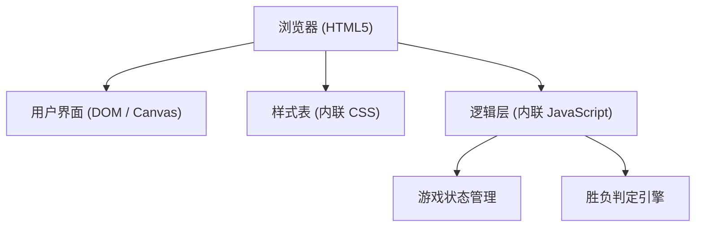

## 1. 架构设计

## 2. 技术说明
- **前端技术**：原生 HTML5 + CSS3 + Vanilla JavaScript。
- **渲染方式**：采用 HTML5 `<canvas>` 进行绘制，能够更好地处理棋盘网格、背景及棋子的 3D 渐变渲染，同时保证良好的性能和精确的像素级控制。
- **打包方式**：无需打包工具，响应用户的“单 html”需求，所有 CSS 和 JS 代码均内嵌在一个单一的 `index.html` 文件中。

## 3. 路由定义
| 路由 | 用途 |
|------|------|
| / | 唯一的单页面应用入口 |

## 4. 数据模型
### 4.1 游戏状态定义
使用 JavaScript 对象和数组在内存中维护游戏状态：
- `board`: 15x15 的二维数组，0 表示空，1 表示黑子，2 表示白子。
- `currentPlayer`: 当前执子方（1 为黑，2 为白）。
- `isGameOver`: 布尔值，游戏是否结束。
- `history`: 一维数组，记录每步落子的坐标，用于悔棋功能。