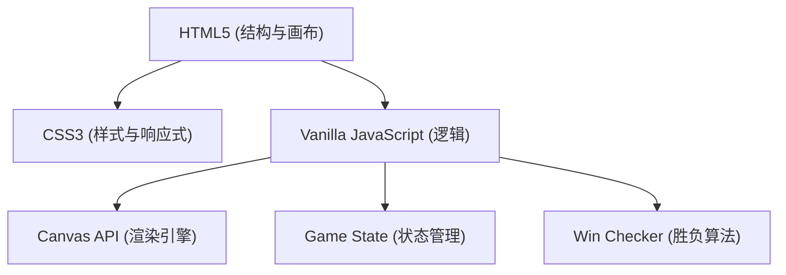

## 1. 架构设计
因为用户明确要求“单html”，本系统采用无构建工具的纯 Vanilla JS + HTML5 + CSS3 实现。所有代码均集中在一个 `index.html` 文件中，无需外部依赖。

## 2. 技术说明
- **前端技术**：HTML5, CSS3, Vanilla JavaScript (ES6+)。
- **渲染方案**：HTML5 `<canvas>` 元素。Canvas 性能优异，非常适合绘制密集的棋盘线和大量具有渐变/阴影的立体棋子。
- **文件结构**：单文件 `index.html`，包含内联 `<style>` 和 `<script>`。

## 3. 核心数据结构定义
- **棋盘数据**：`board` 二维数组（15x15），0表示空，1表示黑子，2表示白子。
- **历史记录**：`history` 数组，用于记录每一步的坐标 `(x, y)` 和落子方，用于实现悔棋功能。
- **状态变量**：
  - `currentPlayer`：当前回合（1为黑，2为白）。
  - `isGameOver`：布尔值，游戏是否结束。

## 4. 核心算法说明
### 4.1 落子坐标转换
- 监听 Canvas 的 `click` 事件，获取鼠标或触摸点相对于 Canvas 的坐标 `(offsetX, offsetY)`。
- 通过计算与网格大小的比例，并四舍五入，转换到最接近的交叉点 `(x, y)`。

### 4.2 胜负判断算法 (Win Checker)
以当前落子点为中心，分别向四个方向遍历：
1. 水平（左、右）
2. 垂直（上、下）
3. 左斜（左上、右下）
4. 右斜（右上、左下）
向两端延伸，统计与当前落子颜色相同的连续棋子数量。如果任一方向连续数量 `>= 5`，则当前落子方获胜，游戏结束。