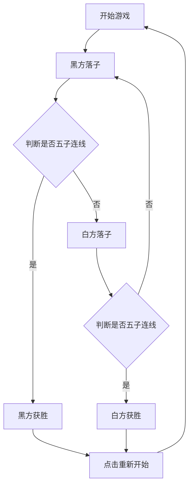

## 1. 产品概述
一款单文件 HTML 格式的五子棋网页游戏，主打高还原度、美观和即开即玩。
- 解决玩家在浏览器中随时随地进行本地双人五子棋对弈的需求。
- 极致精简（仅一个 HTML 文件），具备真实的木质棋盘质感和流畅的落子体验。

## 2. 核心功能
### 2.1 功能模块
1. **棋盘区域**：15x15 标准五子棋盘，包含天元和星位标记。
2. **游戏控制台**：显示当前行棋方、重新开始按钮、悔棋按钮。
3. **结算模块**：判断胜负并弹出优雅的胜利提示。

### 2.2 页面详细说明
| 页面名称 | 模块名称 | 功能描述 |
|-----------|-------------|---------------------|
| 主页面 | 棋盘渲染模块 | 使用 Canvas 绘制木纹棋盘、棋盘线、黑白棋子（带渐变和阴影立体效果） |
| 主页面 | 游戏逻辑模块 | 记录二维数组棋盘状态，处理落子坐标转换，判断五子连线胜负条件 |
| 主页面 | 交互控制模块 | 处理点击落子、悔棋（栈结构）、重新开始对局逻辑 |

## 3. 核心流程
玩家打开页面即可开始对局。黑子先手，双方交替落子。每次落子后系统进行胜负判定。

## 4. UI 设计说明
### 4.1 设计风格
- 主色调：木质棋盘色（#DEB887 或近似实木颜色），背景采用典雅的深灰色，突出棋盘主体。
- 棋子样式：拟物化设计。黑子带有高光，白子带有轻微渐变和阴影，呈现立体感和温润感。
- 按钮与字体：现代极简风格（圆角按钮，无衬线字体，悬停过渡效果）。
- 布局：居中对齐，上方为状态信息，中间为棋盘，下方为操作按钮。

### 4.2 响应式设计
- 桌面端优先，同时完美适配移动端（棋盘宽度自适应屏幕尺寸，支持触摸落子并作适当的防误触处理）。