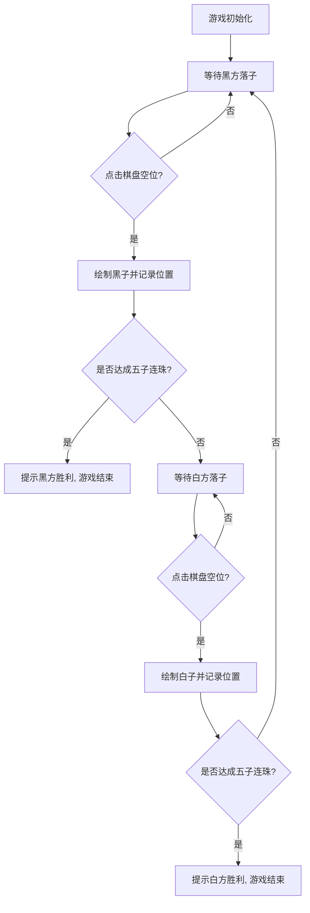

## 1. 产品概述
一款精美的单文件 HTML 五子棋游戏。
- 主要解决在浏览器中随时随地进行五子棋对弈的需求，支持双人同屏对战。
- 为用户提供视觉美观、交互流畅、规则完善（含输赢判定）的休闲游戏体验。

## 2. 核心功能

### 2.1 功能模块
1. **游戏主界面**：棋盘区域、状态提示区域、操作按钮区域。
2. **游戏逻辑模块**：落子逻辑、胜负判定（横、竖、左斜、右斜连成五子）、轮次切换。
3. **游戏控制模块**：重新开始游戏、悔棋（可选）、当前回合提示。

### 2.2 页面详细说明
| 页面名称 | 模块名称 | 功能描述 |
|-----------|-------------|---------------------|
| 主页面 | 状态信息栏 | 显示当前轮到的玩家（黑子或白子），以及游戏胜利/平局状态提示。 |
| 主页面 | 棋盘区域 | 15x15 的标准五子棋网格，响应点击事件进行落子，并绘制黑白棋子。 |
| 主页面 | 操作区域 | 提供“重新开始”按钮，便于对局结束后或中途重新开局。 |

## 3. 核心流程
玩家双方在同一设备上轮流点击棋盘交叉点落子，系统自动判断是否达成五连珠，若达成则宣布胜利并结束当前对局。

## 4. 用户界面设计
### 4.1 设计风格
- **整体基调**：原木风/拟物风 或 极简现代风。考虑到美观，采用带有木质纹理或柔和木色的拟真棋盘，搭配具有立体感（阴影和高光）的黑白棋子。
- **主次颜色**：背景色为浅灰或原木色（#E6B97F 或更柔和的米色），线条为深褐色（#5C3A21），黑子（#111带有反光），白子（#EEE带有阴影）。
- **按钮样式**：圆角、带有一点投影的质感按钮，悬浮时有反馈动画。
- **字体**：现代无衬线字体（系统默认字体即可），标题大气清晰。
- **交互动画**：落子时有轻微的放大缩小（Pop）动画，胜利时有高亮连珠棋子和弹窗动画。

### 4.2 页面设计大纲
| 页面名称 | 模块名称 | UI 元素 |
|-----------|-------------|-------------|
| 主页面 | 棋盘 | HTML5 Canvas 或 DOM 网格。木质底色，15x15深色线条，星位标记。 |
| 主页面 | 棋子 | 径向渐变（Radial Gradient）实现立体感黑白棋子。 |
| 主页面 | 信息板 | 简洁的卡片设计，显示“当前回合：黑子”等字样。 |

### 4.3 响应式设计
- 桌面端优先，同时适配移动端。
- 棋盘大小根据屏幕宽度自适应缩放（使用 CSS vw、vh 或 JS 动态计算），确保在手机上也能完整显示且易于点击。
