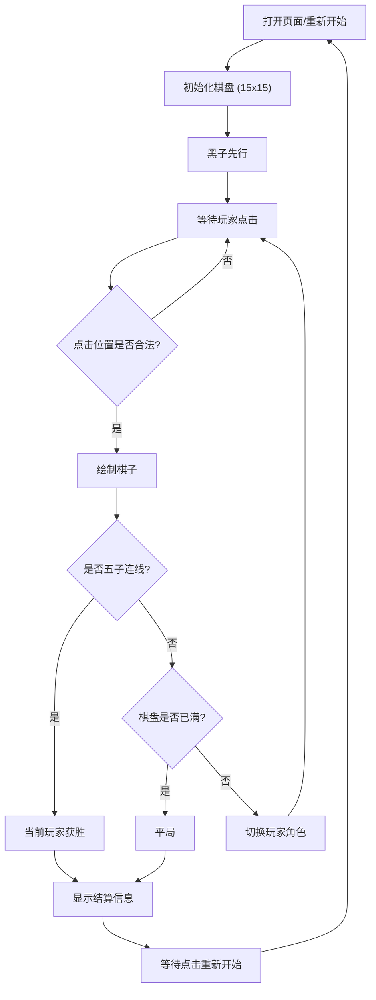

## 1. 产品概述
单文件 HTML 五子棋游戏
- 本项目旨在创建一个高质量、尽力还原经典体验的五子棋游戏，且所有代码需集中在单个 HTML 文件中。
- 目标受众是寻求简单、即点即玩且视觉体验优秀的五子棋玩家。

## 2. 核心功能

### 2.1 用户角色
| 角色 | 注册方式 | 核心权限 |
|------|----------|----------|
| 玩家 | 无需注册 | 进行五子棋游戏，落子，重新开始 |

### 2.2 功能模块
1. **游戏主页**：包含棋盘、黑白棋子、提示信息、控制面板（重新开始、认输等）。
2. **逻辑模块**：胜负判定（横、竖、斜五子相连）、落子合法性检查、轮流机制。

### 2.3 页面详情
| 页面名称 | 模块名称 | 功能描述 |
|----------|----------|----------|
| 游戏主页 | 棋盘区域 | 15x15 的标准五子棋盘，支持点击落子，显示最新落子标记 |
| 游戏主页 | 状态面板 | 显示当前轮到的玩家（黑子或白子），显示游戏结果（胜利/平局） |
| 游戏主页 | 控制按钮 | 提供“重新开始”功能按钮 |

## 3. 核心流程
玩家打开页面，游戏初始化 -> 黑子先行，玩家点击棋盘空位落子 -> 系统判断是否获胜 -> 未获胜则切换玩家（白子） -> 重复直到有一方获胜或棋盘下满平局 -> 玩家点击重新开始 -> 游戏重新初始化。

## 4. 用户界面设计
### 4.1 设计风格
- 整体风格：经典木质质感、拟物化与现代简约结合。
- 主色调：木纹色（棋盘背景）、黑色与白色（棋子）。
- 字体：系统默认无衬线字体。
- 按钮风格：简约带有一点阴影的立体按钮。
- 动画效果：棋子落下时的轻微缩放动画，最新落子带有红色十字标记。

### 4.2 页面设计概览
| 页面名称 | 模块名称 | UI 元素 |
|----------|----------|---------|
| 游戏主页 | 棋盘 | HTML5 Canvas 绘制，木纹背景色，黑色网格线，天元和星位小黑点 |
| 游戏主页 | 棋子 | 带有径向渐变的圆形，模拟立体光泽（黑子带有白色反光，白子带有灰色阴影） |
| 游戏主页 | 状态区 | 大号文本提示当前回合，胜利时的弹窗或遮罩层 |

### 4.3 响应式
桌面端优先，同时适配移动端触摸屏幕。通过 CSS 使棋盘在不同屏幕尺寸下保持正方形且居中显示。
