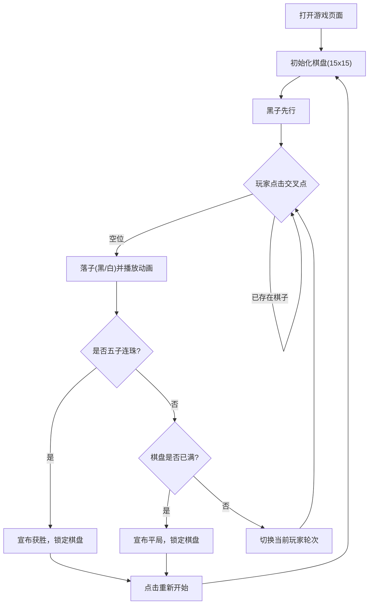

## 1. 产品概述
创建一个精美且尽全力还原的单文件HTML五子棋游戏（Gomoku），将所有HTML、CSS和JavaScript代码包含在一个文件中。
- 主要目的：提供一个即开即玩的网页版五子棋，支持双人对战（本地）。尽全力还原传统五子棋的棋盘木纹质感、棋子立体光泽和下棋交互体验。
- 目标用户：喜欢经典棋盘游戏的玩家、需要打发时间的休闲用户。
- 产品价值：提供极致纯粹、极具美感的下棋体验，注重UI设计、棋子落子动画及交互细节。

## 2. 核心功能

### 2.1 用户角色
| 角色 | 注册方式 | 核心权限 |
|------|---------------------|------------------|
| 玩家 | 无需注册，即开即玩 | 执黑或执白下棋，重新开始游戏 |

### 2.2 功能模块
1. **游戏主页**：状态提示区域（当前轮次、胜负结果）、核心棋盘区域、控制按钮区域。

### 2.3 页面详情
| 页面名称 | 模块名称 | 功能描述 |
|-----------|-------------|---------------------|
| 游戏主页 | 状态面板 | 动态显示当前是“黑方落子”还是“白方落子”，并在游戏结束时展示获胜信息。 |
| 游戏主页 | 棋盘区域 | 15x15标准五子棋盘。包含标准的5个星位标记。点击交叉点落子，支持落子位置的悬停预览。 |
| 游戏主页 | 控制面板 | 提供“重新开始”按钮，便于快速开启下一局。 |

## 3. 核心流程

## 4. 用户界面设计
### 4.1 设计风格
- **主色调**：深邃的禅意背景（如暗青色或炭黑色），配合逼真的木纹质感棋盘（如 #e3b365 到 #c89b4f 的渐变或纹理）。
- **棋子质感**：利用 CSS `radial-gradient` 实现极具立体感和高光的黑白棋子。黑子深邃反光，白子温润如玉，并带有轻微的底部阴影。
- **字体**：使用优雅的无衬线体或现代衬线体，保持界面清爽。
- **布局风格**：卡片式居中布局，突出棋盘主体。
- **交互细节**：鼠标悬停在空交叉点时，显示半透明的当前轮次棋子作为落子预览。落子时加入轻微的放大缩小（Pop）动画。

### 4.2 页面设计概览
| 页面名称 | 模块名称 | UI元素 |
|-----------|-------------|-------------|
| 游戏主页 | 棋盘 | CSS绘制的15x15网格，5个星位黑点，绝对定位的立体棋子 |
| 游戏主页 | 控制器 | 简约圆角按钮，带Hover态变化及点击反馈 |

### 4.3 响应式设计
采用 Desktop-first 设计，通过 CSS Flexbox 或 Grid 以及 `vmin` 单位，确保棋盘在手机屏幕上也能完美等比缩放显示，并优化触摸体验。
