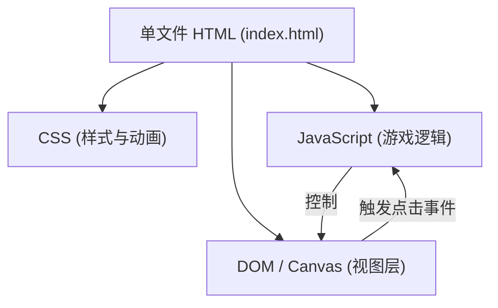

## 1. 架构设计

## 2. 技术说明
- **前端技术**：纯 HTML5 + CSS3 + Vanilla JavaScript。完全零依赖，不使用任何外部框架或库，确保单文件即可运行。
- **视图实现方案**：推荐使用 HTML5 `<canvas>` 绘制棋盘和棋子。Canvas 在绘制大量元素（15x15网格及棋子）时性能极佳，且更容易实现复杂的渐变、阴影等立体效果。如果为了更好的 DOM 交互，也可使用纯 CSS Grid + div，但综合考虑视觉效果和实现单文件五子棋，Canvas 是首选。
- **文件结构**：所有代码整合在 `index.html` 中，包含 `<style>` 标签用于 CSS 和 `<script>` 标签用于 JS 逻辑。

## 3. 核心算法设计
- **棋盘数据结构**：使用一个二维数组 `board[15][15]`，0表示空，1表示黑子，2表示白子。
- **胜负判定算法**：每次落子后，以该落子点为中心，分别向四个方向（水平、垂直、左斜、右斜）统计连续相同颜色的棋子数量。如果任一方向连续达到5个，则判定该方获胜。
- **坐标转换**：需要处理鼠标点击的 Canvas 坐标到棋盘数组索引的精确转换，并加入适当的点击容差。

## 4. 路由与 API 定义
- **无需路由和后端 API**：本项目为纯前端本地单页面应用。

## 5. 数据模型
无需持久化数据库，仅在内存中维护当前对局状态：
- `currentPlayer`: 当前玩家（1 或 2）
- `board`: 15x15 的二维数组
- `isGameOver`: 布尔值，标记游戏是否结束
- `history`: （可选）记录落子顺序的数组，用于实现悔棋功能。