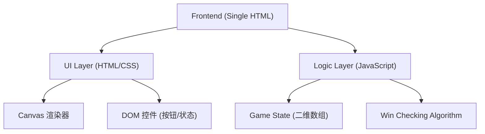

## 1. 架构设计

## 2. 技术说明
- 前端：原生 HTML5 + CSS3 + Vanilla JavaScript。
- 渲染：主要使用 HTML5 `<canvas>` 绘制棋盘和棋子，以达到最佳性能和视觉效果，模拟真实的五子棋盘。
- 打包：全部代码写在单个 `index.html` 文件中，不依赖外部的图片、样式或脚本库，以满足单文件 HTML 需求。

## 3. 路由定义
单页应用，无路由。

## 4. 数据模型
游戏状态主要存储在 JavaScript 变量中：
- `board`: 15x15 的二维数组，0 表示空，1 表示黑子，2 表示白子。
- `currentPlayer`: 当前玩家，1 代表黑子，2 代表白子。
- `isGameOver`: 布尔值，标记游戏是否已经结束。
- `lastMove`: 对象 `{r, c}`，记录上一步落子位置，用于在棋盘上标记最后落子点。
