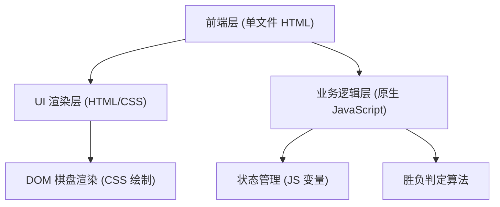

## 1. 架构设计

## 2. 技术说明
- **前端技术栈**：纯 HTML5 + CSS3 + Vanilla JavaScript (原生JS)。
- **部署与环境**：单文件 `index.html`，无需任何构建工具（Webpack/Vite等），无需依赖第三方库（如 React/Vue），确保代码极致精简，即开即玩。
- **渲染方案**：采用 DOM 元素配合 CSS 绝对定位进行棋盘和棋子的渲染，利用 CSS3 的 `radial-gradient` 和 `box-shadow` 极力还原木质棋盘和立体棋子的真实质感。

## 3. 路由定义
本应用为纯单页面、单文件应用，无外部路由。
| 路由 | 用途 |
|-------|---------|
| index.html | 游戏唯一主界面 |

## 4. API 定义
纯本地单机游戏，无后端 API 请求。

## 5. 数据模型
### 5.1 状态管理模型
游戏状态保存在内存（JavaScript 变量）中：
- `board`: 二维数组 `number[15][15]`，记录棋盘每个交叉点的状态（0 = 空位，1 = 黑子，2 = 白子）。
- `currentPlayer`: 数字 `1` 或 `2`，记录当前执子方（黑方先手）。
- `isGameOver`: 布尔值 `boolean`，记录对局是否结束，若结束则锁定棋盘不可落子。

### 5.2 核心判定算法
- **五子连珠判定**：每次玩家成功落子后，以当前落子坐标 `(x, y)` 为中心，分别向四个方向（水平 0°、垂直 90°、左斜 45°、右斜 135°）双向扩散统计连续同色棋子的数量。任意一个方向达到或超过 5 个即判定当前玩家获胜。
